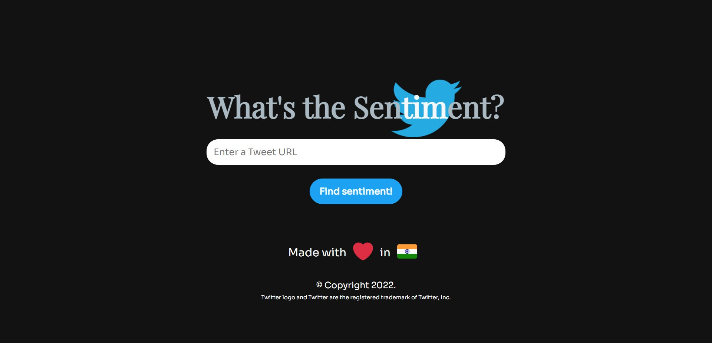
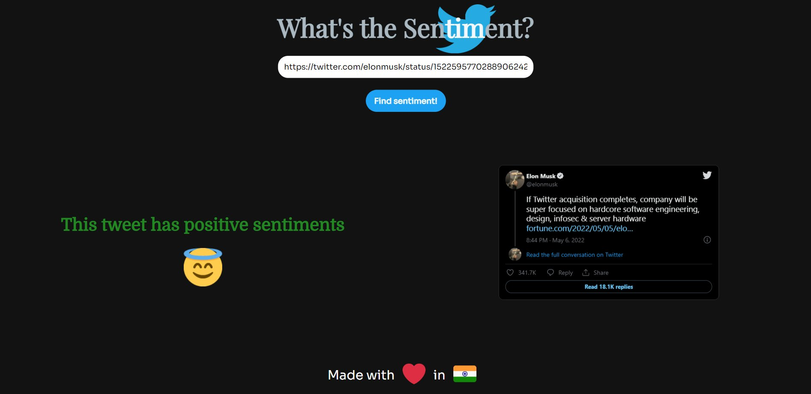
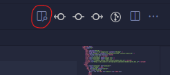
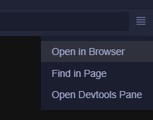

<h1>Twitter Sentiment Analysis</h1>

## Introduction

This is the mini project for one of 7th semester subject. In this project, I have trained a classifier using <strong>Logistic Regression</strong> with an accuracy of 80% with <strong>Sentiment140 dataset (with 1.6 million tweets)</strong> from Kaggle.

After building this classifier model, I have created an API endpoint using FastAPI to get the data (or tweet) and classify it as having positive (1) or negative sentiments (0) and send this classification result as a response.

I have created a web app frontend using which user can enter a tweet's URL. After getting the URL, this web app sends the URL to the API endpoint which have created and by and by using Twitter's API we will get the proper tweet (data). After reviving this data will get a response whether the tweet has positive or negative sentiments.

## Screenshots




## Instruction before running this project

Replace the OAuth Token from Twitter (google how to get the OAuth Token of Twitter) inside the server.py file.

## How to run?

1. Clone this repository.
2. Create a virual environment using following command.
   ```
   $ python -m venv SentimentAnalysisServer
   ```
3. After creating the virual environment activate it.

   ```
   $ .\SentimentAnalysisServer\Scripts\Activate.ps1
   ```

4. Next after activating this virtual environment, we will install all the required packages using requirements.txt
   ```
   $(SentimentAnalysisServer) pip install requirements.txt
   ```
5. After all the packages have been installed. Use the following command to start the FastAPI server
   ```
   $(SentimentAnalysisServer) uvicorn server:app --reload
   ```
6. Congratulations you have successfully started the FastAPI server.
7. To run the frontend, open the folder web-app inside Visual Studio Code. After that open the index.html file and click on the button on the top right side of the screen as shown in the following screenshot. This will open the web app in live preview mode.

   

8. After performing the above step a new splited view will open in the Visual Studio Code. Click on the button on the top right of the page as shown in the following screenshot. This will open the web app in the browser.

   

9. All done!

## Made with ♥️ in India :)
